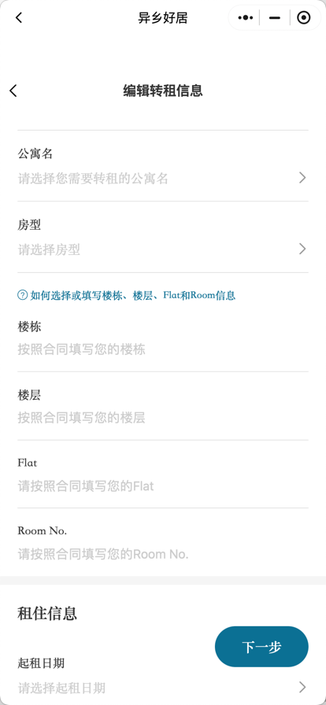
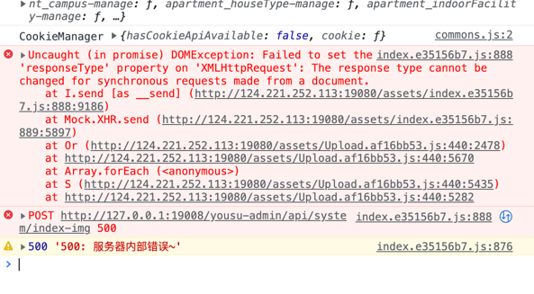
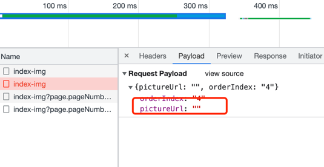
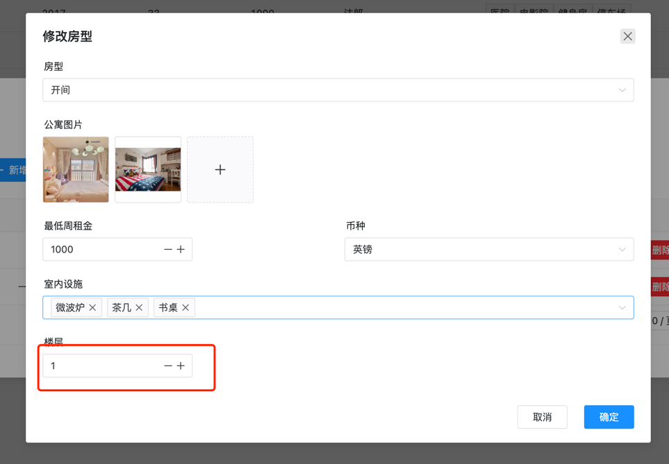

# TODO

- [x] token 失效跳回 login

- [x] 每个页面的列表都要去掉 id

- [x] 首页轮播图管理，新增和编辑要上传图片
      http://124.221.252.113:40001/project/15/interface/api/cat_53
- [x] 用户管理添加搜索条件：用户名，昵称，手机号，角色，其中角色要进行选择传递 id
      http://124.221.252.113:40001/project/15/interface/api/83
- [x] 租房申请-完善处理人分配功能

- [x] 用户中心页面用于修改

- [x] 仪表盘页面删除

- [x] 菜单管理页面开发，http://124.221.252.113:40001/project/15/interface/api/cat_17

- [x] 给角色管理添加功能，增加维护菜单按钮，相关接口：
      http://124.221.252.113:40001/project/15/interface/api/524
      http://124.221.252.113:40001/project/15/interface/api/531
      http://124.221.252.113:40001/project/15/interface/api/62

- [x] 转租申请相关接口：http://124.221.252.113:40001/project/15/interface/api/cat_55
  - 用户首先在小程序端填写转租信息，类似于异乡好居
  - 管理端有转租申请页面，能够进行图片编辑【任何时候】，审核通过【待审核状态】，驳回【待审核状态】等操作，其中驳回要填写原因
  - 审核通过之后会自动生成一条转租信息
- [x] 转租相关接口：http://124.221.252.113:40001/project/15/interface/api/cat_59

  - 转租房是转租申请通过后产生的，页面需要一个下架操作

- [x] 注册完成之后跳转登录页面
- [x] 测试环境轮播图新增有 bug，本地环境没有问题，
  - 
  - 
- [x] 轮播图 order 添加校验，只能填写数字，1 ～+∞，添加页面提示，数字越小排位越前
- [x] 新增/修改公寓房型中楼层字段改为普通的输入框，因为可能输入为 1 ～ 12 之类的
      

- [x] 签约管理添加搜索条件，【销售人员】

- [x] 客户管理页面暂时注释掉

- [ ] 详情页面没有区分度

- [x] 转租审核通过之后没有刷新页面

- [x] 登录页面记住我删除，有时间就添加回车登录
